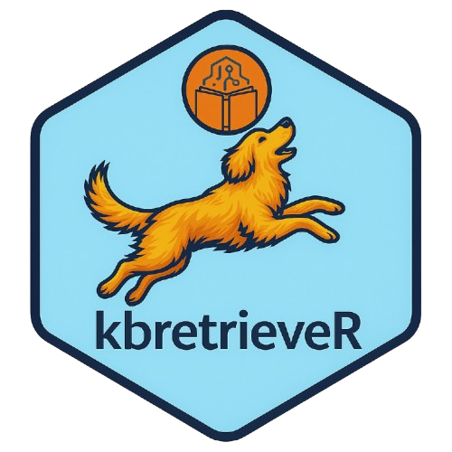
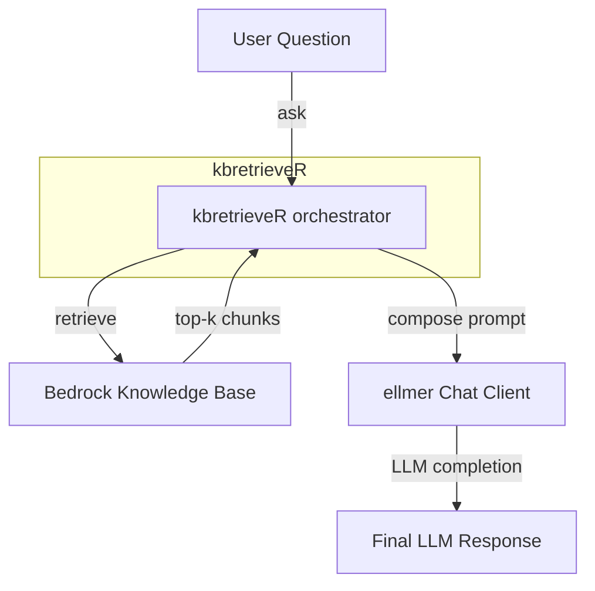

# kbretrieveR <a href="https://lazasaurus-ai.github.io/contextR"></a>

Thin interface for AWS Bedrock Knowledge Bases from R.

**kbretrieveR** retrieves relevant chunks from an AWS Bedrock Knowledge Base, then merges them into the prompt passed to your preferred chat client (e.g. ellmer::chat_aws_bedrock).

## Installation

``` r
# from devtools / remotes
remotes::install_github("MDRCNY/kbretrieveR")
```

## Background Info

`kbretrieveR` is an R package that lets you work directly with AWS Knowledge Bases. If your project has a Knowledge Base with project details or coding best practices, you can connect it to `ellmer` and feed that context into your R session. From there, you can generate parameterized Markdown or Quarto documents that automatically incorporate the KB as context.

The package is more than just a chat client—it’s a building block. Its real value comes when you use it in parameterized reports or AI agents. Instead of hard-coding prompts or constantly updating them as information changes, `kbretrieveR` lets your AI workflows dynamically retrieve the latest knowledge base context, ensuring your R agents can generate outputs grounded in up-to-date, project-specific information.

## Quick Start

``` r
library(kbretrieveR)

# Create a client (replace with your KB ID & region)
client <- KBClient$new(
  kb_id = "1234ABCE", # OR Sys.getenv("AWS_KB_ID")
  region = "us-east-1", # OR Sys.getenv("AWS_REGION")
  chat_client = ellmer::chat_aws_bedrock(
    model = "anthropic.claude-3-5-sonnet-20240620-v1:0"
  )
)

# Retrieve docs - will print tibble table of retrieved context chunks from AWS KB
client$retrieve("Tell me about my companies new projects?")

# Chat with context injected
client$chat("Summarize the companies new projects in 3 bullet points.")

# Limit sources to only those with highest relevance and append the sources
client$retrieve("Tell me about my companies new projects?", number_of_results=3)
client$chat("Summarize in 3 bullet points", number_of_results=3, append_sources = TRUE)
```

### Configuration

You can store defaults in your `.Renviron` for convenience similar to `ellmer`:

``` r
AWS_ACCESS_KEY_ID = "  "
AWS_SECRET_ACCESS_KEY = "  "
AWS_SESSION_TOKEN = "  "
AWS_REGION = "us-east-1"

AWS_KB_ID="1234ABCE"
```

⚙️ How It Works



## 🔧 KBClient Configuration & Streaming

`KBClient()` is the core interface in `kbretrieveR` for interacting with an AWS Bedrock Knowledge Base and optionally calling a chat model (e.g. via `ellmer`). It stores convenient defaults (KB ID, region, chat client, and prompt limits) and can optionally stream responses when supported by the underlying model client.

🧱 Constructor

``` r
client <- KBClient$new(
  kb_id = Sys.getenv("AWS_KB_ID"),                 # Knowledge Base ID
  region = Sys.getenv("AWS_REGION", "us-east-1"),  # AWS region
  chat_client = ellmer::chat_aws_bedrock(
    model = "anthropic.claude-3-5-sonnet-20240620-v1:0"
  ),
  default_number_of_results = 5,   # Default KB retrieve size
  default_max_snippets = 5,        # Default number of context snippets injected into the prompt
  default_snippet_chars = 1500,    # Max characters per snippet
  include_metadata = TRUE,         # Include metadata (source URIs, chunk IDs) in the prompt
  verbose = TRUE                   # Print progress messages
)
```

### 💬 Chat Configuration Options

| Method                                       | Description                                                                                      |
| -------------------------------------------- | ------------------------------------------------------------------------------------------------ |
| `$retrieve(question, number_of_results = 5)` | Retrieve context snippets from the Knowledge Base. Returns a tibble with text, URIs, and scores. |
| `$chat(question, ...)`                       | Retrieve KB context, build a prompt, and query the chat client. Returns the assistant reply.     |
| `$inspect(question)`                         | Pretty-print the retrieved snippets and their metadata for inspection.                           |
| `$set_chat_client(client)`                   | Replace the chat client (e.g., swap between Bedrock models).                                     |
| `$format_citation(row)`                      | Format a single KB row into a markdown citation link.                                            |
| `$as_list()`                                 | Return all internal defaults and configuration values.                                           |


Example in R Code:

```{r}
client$chat(
  question,               # user input text
  kb_id = NULL,           # override KB ID
  chat_client = NULL,     # override chat client
  number_of_results = 5,  # KB context size
  max_snippets = 5,       # number of snippets to inject
  snippet_chars = 1500,   # characters per snippet
  append_sources = FALSE, # append "Sources" list to reply
  return_raw = FALSE,     # return full response + prompt + parsed KB
  verbose = TRUE,         # show progress
  stream = FALSE,         # ⚡ optional streaming mode (default = FALSE)
  stream_fn = NULL        # optional custom streaming wrapper
)
```

### ⚡ Streaming Support

Starting in v0.2.x, `KBClient$chat()` can stream output from Bedrock models when the underlying chat client supports it (e.g., `ellmer::chat_aws_bedrock()`).

# non-streaming (default)
```
resp <- client$chat("Summarize our recent projects")`
```

# streaming (opt-in)
```
resp_stream <- client$chat("Summarize our recent projects", stream = TRUE)
```

-   When `stream = TRUE`, the method attempts to call one of these on the chat client:

    -    `$stream(prompt)`

    -    `$stream_async(prompt)`

    -    `$call(prompt, stream = TRUE)`

<!-- -->

-    If none are found, it will raise a clear error (`"Streaming requested but chat_client has no recognized streaming entrypoint"`).


> Note:
Streaming is off by default to preserve backwards-compatible, synchronous behavior.
You can enable it per-call with stream = TRUE, or globally via an R option:
```
options(kbretrieveR.stream_default = TRUE)
```

